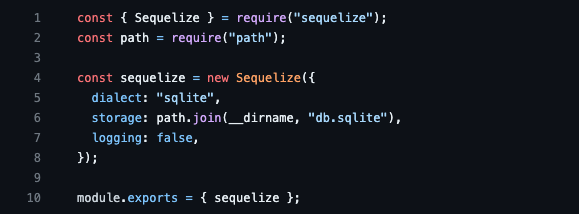

# Project 5 - The Circle Chat 

An enhanced breakdown of the project purpose: 

## :memo: Situation 

The Circle Chat is a full-stack web application created for Module 1 - Backend, week 5 of the Multiverse Curriculum. The main concept of the Circle Chat is to demonstrate a full-stack web application in which the user can chat with their friends in real time. This project also demonstrates proficiency in the use of backend technologies like Express, and frontend technologies like React and Vite. 

## :pushpin: Task

<li>There were multiple integral parts to this projects, especially the backend architecture as well as the architecture of chat functionality. In this project, my task was to build out the backend server, database, models, routes, and middleware. All of these files were house in the <code>server</code> folder. The frontend was an addition to the project housed in the <code>client</code> folder.</li>

 

<li>The main focus of this project was centered about the functionality of the live chat. As a group, my teammates and I wanted to make sure that the backend was configured properly so that it fell in line with how we wanted the UI to look as well. My team and I established weekly planning sessions so that we could complete the project. We created a wireframe so that we could have a clear layout as to how we wanted to structure our application.</li>

 

## :computer: Action

<li>My main contribution to this application revolved around backend development.</li>

 

<li>Creating the <code>db</code> file to instantiate the database, instantiating the server</li>

 

 

<li>Creating the <code>User</code> and <code>Messages</code> models that establish th data types for the user and the posts, and establishing the associations between models</li>
 

 

 

<li>Creating a file to handle all middleware so that <code>HTTP</code> requests could be made and input data from the messages could be handled from the front-end</li>
 

<li>Creating routes for the <code>User</code> and <code>Messages</code>, setting up the initial login/hashing routes</li>
 

 

 

## :movie_camera: Result (Video Presenation + Project Repo)

- [The Circle Chat Repo](hhttps://github.com/thecirclechat/circle-chat-backend)
- [Circle Chat README](https://github.com/thecirclechat/circle-chat-backend/blob/main/README.md)
- [Circle Chat Kanban Board](https://github.com/orgs/thecirclechat/projects/1)

<i>Click the thumbnail below to be redirected to the presentation video!</i>

## :floppy_disk: Technologies

Front End
<ul>
<li>Tailwind CSS<code>(v3.2.6)</code></li>
<li>PostCSS <code>(v8.4.21)</code></li>
<li>CSS</li>
<li>HTML</li>
</ul>

Back End
<ul>
<li>Express <code>(v4.18.2)</code></li>
<li>CORS(Cross-origin resource sharing) <code>(v2.8.5)</code></li>
<li>Jest <code>(v29.4.1)</code></li>
<li>Sequelize <code>(v6.29.0)</code></li>
<li>Sqlite3 <code>(v5.1.4)</code></li>
<li>PassportJS <code>(v0.6.0)</code></li>
<li>Supertest<code>(v6.3.3)</code></li>
<li>bcrypt<code>(v5.1.0)</code></li>
</ul>

Other dependencies
<ul>
<li>Concurrently <code>(v8.0.1)</code></li>
<li>Dotenv <code>(v16.0.3)</code></li>
<li>Morgan <code>(v1.10.0)</code></li>
<li>Socket.io<code>(v4.6.1)</code></li>
</ul>

## :book: Competencies

### JF 1.5

#### Can work effectively and contribute appropriately on a team to produce software

Not only did I work independently on the parts that I added to this project but I also effectively collaborated with my team. In order to complete this action, I helped to facilitate weekly meetings not only to discuss project topics but also to discuss how to begin the SDLC for our project. I would work with my team to assign individual tasks to each member of the group, make sure that they were comfortable with the task, and also offer help should the need arise. I also created a group WebEx space so that we could all effectively communicate with each other.

### JF 1.6

#### Can follow software designs and functional/technical specifications

By reviewing all project requirements, myself and my team were able to break down how this project needed to be completed. By following the guidelines that were laid out for each tier of the project, I was able to complete each component of the project that was assigned to me. In doing so I was not only able to complete my assigned tasks but also assist with other tasks that were assigned to the team.

### JF 2.1

#### Can create and analyze artifacts, such as use cases and/or user stories

While implementing the code for the backend, i.e. defining the models, I thought of ways the user could interact with the application. An example is that a user can log on to the website and instantly message their friend as well as see all of the messages that they have sent.

### JF 2.4

#### Can create simple software designs to effectively communicate understanding of the program

I collaborated and took the lead on multiple tasks throughout this project, including the way in which our code was structured. I first started by building out the model for our backend so that we could accurately list all of the data that we needed. I then set up the middleware as well as the initial login routes, that included hashing. I participated in various sessions that led to delegation of specific tasks that need to be completed. 

### JF 2.6

#### Can translate wireframes into User Interfaces

For this project, I and my team used a wireframe to lay out how we wanted our front end to interact with the backend. Using a wireframe allowed us to really think about what we wanted from this application and how we all wanted it to look. Through this, I was also able to communicate, break down, and visualize how I thought users should interact with the application. While the application is simplistic in its design, using a wireframe for the planning portion of the project was very useful.

### JF 3.4

#### Can create a logical and maintainable codebase

Throughout this project, I assisted in merging pull requests from various branches that were created for each component of the project. I collaborated and took the lead on multiple tasks that were assigned throughout the duration of this project as well. Through code reviews, I was able to review code with my team to merge and approve pull requests. By creating branches for specific components of the project, I was able to help maintain readability within the code base.

### JF 3.6

#### Can implement a RESTful API

In order to complete this task, I followed the software architecture that makes an API RESTful, this includes:

- Having a client-server architecture, in this case, a front end that communicates directly with a backend that is made up of a server and HTTP requests
- Using multiple endpoints such as GET, POST, PUT, AND DELETE
- Using middleware to have access to sending requests and receiving responses via HTTP requests
- Having stateless-client communication
- Having data represented in the form of JSON
- Using resource-based data retrieval, For example, '/messages' represents a list of messages, but "/messages/1" represents a specific message.

### JF 5.5

#### Understands and can apply structured techniques to problem-solving, can debug code, and can understand the structure of programs to identify and resolve issues

When creating this application, there were a lot of obstacles that I and my team faced, specifically when it came to debugging. In order to make sure that I was getting the desired information from each endpoint, my team and I used console logs to verify that the data was in fact being retrieved in the browser. My team and I also utilized our weekly team meetings to have debugging sessions to make sure that our application was working the way that we wanted.

### JF 6.5

#### Works collaboratively with a wide range of people in different roles, internally and externally, with a positive attitude to inclusion & diversity

For this project I worked with two other people, it has never been difficult for me to work in a group and collaborate with others. I find that for certain projects this is the easiest approach, especially with projects that require multiple stages of development. Throughout the time that I worked with my teammates on this project, we all worked together to establish effective lines of communication and talk to resolve any issues that we may have had. We held team meetings twice a week to discuss any tasks that we were working on and worked to solve any bugs that came up as well. I made myself available to my teammates whenever they needed me.

## Collaborators

<ul>
<li> Mamragbe Diaby: <a href="https://github.com/MabeDiaby">@MabeDiaby</a></li>
<li> Lauren Richardson: <a href="https://github.com/l-Rich">@l-Rich</a></li>
<li> Krystal Lopez: <a href="https://github.com/krystallopez">@krystallopez</a></li>
<li>Mariah Dixon: <a href="https://github.com/Mariah-Dixon">@Mariah-Dixon</a></li>
</ul>
